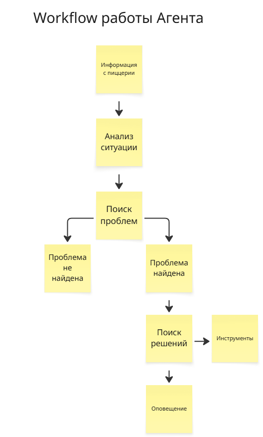
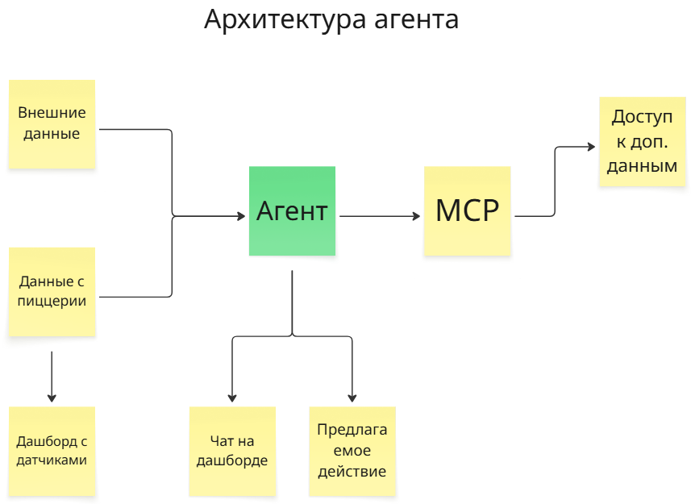

## Цель
Создание интеллектуального помощника мониторинга процессов пиццерии, для уведомления об узких местах. 

### Почему бы не использовать эвристики?
Цель агента не просто мониторить показатели, а прогнозировать непредвиденные ситуации и предлагать решения конкретных проблем
## Метрики

Метрики для оценки агента на этапе MVP

| Метрика                        | Название           | Формула / Смысл                                                                           | Целевое значение | Обоснование                                                                                                |
|:-------------------------------|--------------------|-------------------------------------------------------------------------------------------|:-----------------|:-----------------------------------------------------------------------------------------------------------|
| Точность прогноза пика заказов | Peak Precision     | (Количество предсказанных пиков, которые сбылись) / (Общее количество предсказаний пиков) | 80%              | Чтобы агент не спамил ложными тревогами и менеджер доверял предупреждениям                                 |
| Полнота обнаружения пиков      | Peak Recall        | (Количество реальных пиков, которые были предсказаны) / (Общее количество реальных пиков) | 85%              | Чтобы агент не пропускал реальные всплески заказов и менеджер успевал подготовиться                        |
| Точность прогноза дефицита     | Stock Accuracy     | (Количество верно предсказанных дефицитов) / (Общее количество предсказанных дефицитов)   | 90%              | Сколько раз предсказание дефицита сырья подтвердилось реальным окончанием на смене                         |
| Время ответа агента            | Response Time      |                                                                                           | 10 сек           | Сколько времени агент думает над решением после возникновения проблемы — важно для оперативности менеджера |
| Доля галлюцинаций              | Hallucination Rate |                                                                                           | 10%              | Сколько раз агент видел проблему, но ее на самом деле не было                                              |
| Верно вызванные инструменты    | Tool Accuracy      | Насколько верно агент вызвал инструмент для поиска информации или решения проблемы        | 90%              | Чтобы предлагать конкретные решения, а не просто оповещать о проблеме                                      |

Метрики для оценки агента на этапе эксплуатации

| Метрика                    | Название       | Целевое значение | Обоснование                                                                                                    |
|:---------------------------|----------------|:-----------------|:---------------------------------------------------------------------------------------------------------------|
| Доля принятых рекомендаций | Acceptance Rate| 70%              | Сколько советов агента менеджер реально применил (клики на "Выполнить" / отметки о решении)                   |
| Снижение времени ожидания  | Wait Time Reduction | 15%          | На сколько процентов сократилось время, которое заказы лежат на тепловой полке в ожидании выдачи/курьера       |
| Снижение числа дефицитов   | Stock-out Reduction | 50%          | На сколько процентов сократилось количество смен, где закончилось критическое сырье (тесто, соус, топпинги)   |
| Снижение задержек доставки | Delay Rate Reduction | 10%          | На сколько процентов сократилось количество заказов, доставленных позже обещанного времени (особенно в дождь) |
| Время ответа агента        | Response Time  | 3 сек            | Сколько времени агент думает над решением после возникновения проблемы — важно для оперативности менеджера    |
| Доля галлюцинаций          | Hallucination Rate | 2%           | Сколько раз агент предлагал решение на основе несуществующих данных (например, неверный адрес пиццерии)       |

## Workflow и потенциальная архитектура

Раз в N минут, система будет собирать и анализировать текущую ситуацию в пиццерии. На основе полученных данных, будет приниматься решение об оповещении пользователя.

Размер контекста будет регулироваться скользящим окном - чтобы не копить в памяти данные за целый день, а смотреть только на актуальные

Примерный список инструментов для агента (будет дополняться в процессе разработки)
 - Получить информацию о сырье на других пиццериях
 - Посмотреть график сотрудников
 - Поставить продукт в "стоп"
 - Автономная оценка отдельных показателей для изоляции контекста LLM

### Интерфейс
Для мониторинга показателей будет подготовлен интерактивный дашборд. Взаимодействие с агентом будет в чате на дашборде

## Потенциальный data flow
Агент будет подсвечивать проблемы и предлагать решение.

ВАЖНО: Агент не принимает решение в "опасных ситуациях", таких как:
- Постановка продуктов или пиццерии в "стоп" (остановка приема заказов)
- Самостоятельный вызов дополнительных сотрудников
- Самостоятельный заказ сырья

Основная задача: найти или предвидеть потенциальные узкие места, вовремя оповестить пользователя и предложить решение.

Для оценки работы агента будет создан симулятор процессов пиццерии, основанных на обезличенных данных реальной пиццерии.

## Стоимость эксплуатации агента

Учитывая сложность системы и ее вариативность в процессе разработки, оценка стоимости эксплуатации агента будет приведена после разработки MVP.